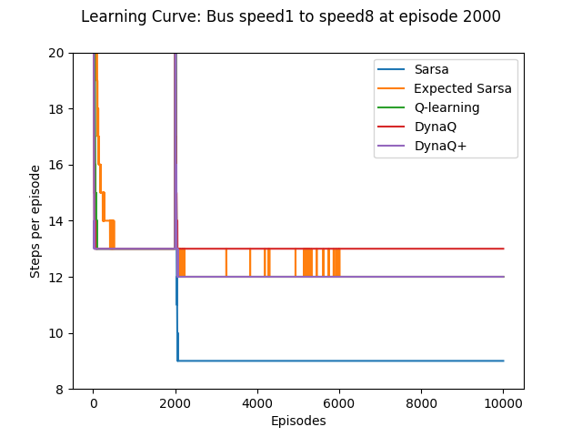
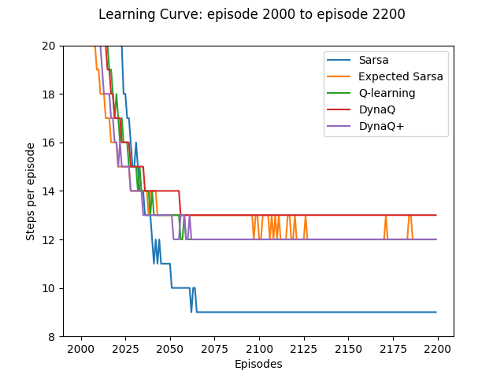
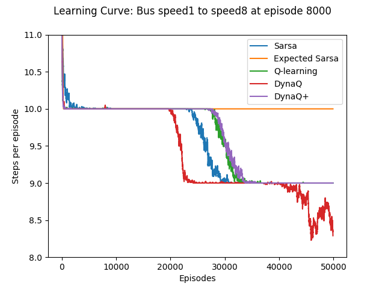

# A Comparative Study of Reinforcement Learning Agents on Non-Stationary Bus Schedule

-----

In the project, I introduce Bus Gridworld, composed of bus route and walking path which a novel way of creating a non-stationary environment in tabular setting, that can be used to test the adaptability of the agents on the non-stationary environment. The result shows that Dyna-Q and Dyna-Q+ agents adapt well to the non-stationary environment, and Sarsa agent also works well when promoted to explore at the time the environment changed.

Please view the "A Comparative Study of Reinforcement Learning Agents on Non-Stationary Bus Schedule.pdf" for details.

If you want to reproduce the results, simply clone the repository then execute two bash scripts: Experiment1/EXPERIMENT1.sh and Experiment2/EXPERIMENT2.sh 

-----

## Bus Gridworld

Figure 1: Bus Gridworld1|Figure 2: Bus Gridworld2
:-------------------------:|:-------------------------:
  |  

Bus Gridworld is undiscounted,
episodic task, with start and goal states denoted as S and G.
The two bus stops are colored in orange, whereas the road
for the bus is colored in green. The reward is -1 for every
step to encourage the agent to explore. The states and actions
are finite, where the agent can take one of five actions
at each step: up, right, down, left, and stay.

Bus Gridworld1 of Figure 1 is the easier version of the
environment for the agent to explore since one bus stop is
near the start state, and the other bus stop is near the goal
state. 
However, Bus Gridworld2 of Figure 2 is a more tricky
version since the bus stop is far from the start state. In Bus
Gridworld2, if the agent learned the short walking path from 
the start state to the goal state, then it would be hard for the
agent to discover the bus stop, even for the agent using epsilon-greedy policy.

## Experiment

The goal of the experiment is to understand what makes the
agent in general deal well with non-stationarity. Five agents
were tested in the experiment: Sarsa, Expected Sarsa, QLearning,
Dyna-Q, and Dyna-Q+.

I used [RL-Glue](http://glue.rl-community.org/wiki/Main_Page) which provides a standard interface that is used in experimenting reinforcement learning problems.

### Experiment1: Bus Gridworld1

Experiment1 tests the adaptiveness of the five agents in Bus Gridworld1 with epsilon 0.

Two different non-stationary bus speed was tested on this environment:

#### Bus speed 8 -> 1

Figure 3: Overall Performance| Figure 4: After Change in the Bus Speed
:-------------------------:|:-------------------------:
  |  

Initially, when the bus speed was
8, all the agents found the shortest path by riding the bus.
DynaQ and DynaQ+ found the shortest path in 10 steps, followed
by Sarsa, Q-learning, and Expected Sarsa. After 2,000
episodes, by the time when all the agents greedily take the
bus to reach the terminal state, the bus speed was decelerated
to 1.

Figure 3 and Figure 4 shows the averaged results over 300
runs for the five agents. The graph demonstrates the number
of steps per episode. In the first 2,000 episodes, all the five
agents found the shortest route by taking the bus. After the
bus speed had decelerated to 1, the graph for Expected Sarsa
was three steps above other graphs near the 4,000 episodes,
showing that it was unable to find the shortest walking path.
DynaQ and DynaQ+ agents precisely solved the Bus Speed
8 -> 1 experiment in less than 25 episodes, followed by
Sarsa and Q-learning agents.

#### Bus speed 1 -> 8

Figure 5: Overall Performance| Figure 6: After Change in the Bus Speed
:-------------------------:|:-------------------------:
  |  

Bus Speed 1 -> 8 experiment started with the bus speed
of 1. After 2,000 steps all the agents had learned to walk
the shortest path to the terminal state. Then the bus speed
accelerated to 8 creating the shorter path without interfering
with the previously found shortest path.
Here, I increased epsilon to 0.5 to promote the five agents to explore more
when bus speed had accelerated. From then, epsilon was decreased
gradually by multiplying 0.95 per episode.

The Figure 5 and Figure 6 shows the results averaged
over 300 runs. In the first 2,000 episodes, all the five agents
found the shortest route by walking to the terminal state,
though DynaQ and DynaQ+ agents took around 30 steps
which are considerably faster than other three non-planning
agents. After the bus speed was accelerated to 8, Figure 6
shows that Sarsa agent started exploring more than 40 steps
per episode, taking much more steps compared to the other
four agents. As a result, Sarsa agent found the path to ride
the bus that ended up in 9 steps per episode. Expected Sarsa,
Q-learning, DynaQPlus agents also found a way to ride the
bus, but the result was not promising since the agents ended
up in 12 steps. DynaQ agent failed to locate the path to ride
the bus.

### Experiment2: Bus Gridworld2

Experiment2 tests the adaptiveness of the five agents in Bus Gridworld2 with epsilon 0.05.

Two different non-stationary bus speed was tested on this environment:

#### Bus speed 8 -> 1

Figure 7: Overall Performance| Figure 8: After Change in the Bus Speed
:-------------------------:|:-------------------------:
  |  

Initially, when the bus speed was
8, all the agents found the shortest path by riding the bus. In
the first 8,000 episodes, a thick line represents that the agents
are exploring since the epsilon of the agents is set to 0.05. DynaQ,
DynaQ+, and Q-learning found the shortest path in around
40 steps, followed by Sarsa, Q-learning, and Expected Sarsa.
After 8,000 episodes, by the time where all the agents were
relatively stable to take the bus to reach the terminal state,
the bus speed was decelerated to 1.

Figure 7 and Figure 8 illustrates averaged results over 300
runs for the five agents. The graph shows the number of steps
per episode. In the first 8,000 episodes, all the five agents
found the shortest route by taking the bus. After the bus
speed had decelerated to 1, DynaQ+ solved the Bus Speed 8 -> 1
experiment in around than 30 episodes, followed by
Q-learning, DynaQ agents. Sarsa and Expected Sarsa were
slow in finding the shortest walking path here since they explored
around 10,000 episodes.

#### Bus speed 1 -> 8

Figure 9: Overall Performance| Figure 10: After Change in the Bus Speed
:-------------------------:|:-------------------------:
  |  

After 8,000 steps all the agents learned to walk the shortest
path to the terminal state. Then the bus speed accelerated
to 8 creating the shorter path without interfering with the
previously found shortest path. Unlike previous Bus Speed 1 -> 8
held on Bus Gridworld1, the epsilon of the five agents stayed
the same. Hence they were not forced to explore more.

The Figure 9 and Figure 10 shows the results averaged
over 300 runs and then smoothed by the mean of the following
100 episodes. In the first 8,000 episodes, all the five
agents found the shortest route by walking to the terminal
state. After the bus speed accelerated to 8, the straight line
for Expected Sarsa agent of Figure 10 reveals that it was
unable to find the path to ride the bus. At around 20,000
steps, DynaQ agent found the way to ride the bus followed
by Sarsa, Q-learning, and DynaQ+ agents.

## Result

In the experiment where the environment got worse, Bus
Speed 8 -> 1, Dyna-Q agents quickly adapted to the world as
expected. However in the experiment where the environment
got better, Bus Speed 1 -> 8, Dyna systems did not explore
much to find the shorter path. However, Figure 6 shows that
when the agents were given high epsilon by the time environment
changed, Sarsa agent was able to find the shorter path.

From these experiments, I conclude that Dyna systems
generally adapt to the non-stationary environment faster
compared to other agents. However, if forced to explore
more by the time the environment changes, Sarsa adapted
to the environment better compared to the DynaQ+ Agent.
This result contradicts the feature of Dyna-Q architectures
that they are easy to adapt for use in changing environments.
The discrepancy is perhaps due to the sensitivity
issues of Dyna-Q agents.

## Conclusion

The experiments performed in the paper are restricted to the
two different non-stationary Bus Gridworld. Also the limited
number of the state-action pairs as well as the finite number
of parameter sets tried on the five agents may have affected
the result of the experiments. However, I showed that Bus
Gridworld creates non-stationary environment that could be
used in testing how well the agents adapt to the changing
environment. I believe that more experiments such as using
options should be conducted on this domain to compare the
robustness of the agents on the non-stationary environment.
However, I defer this for the future work.
